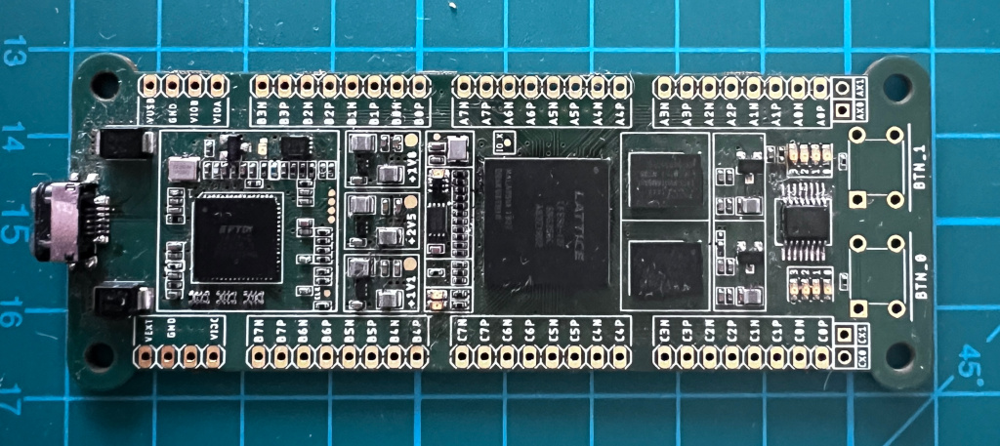
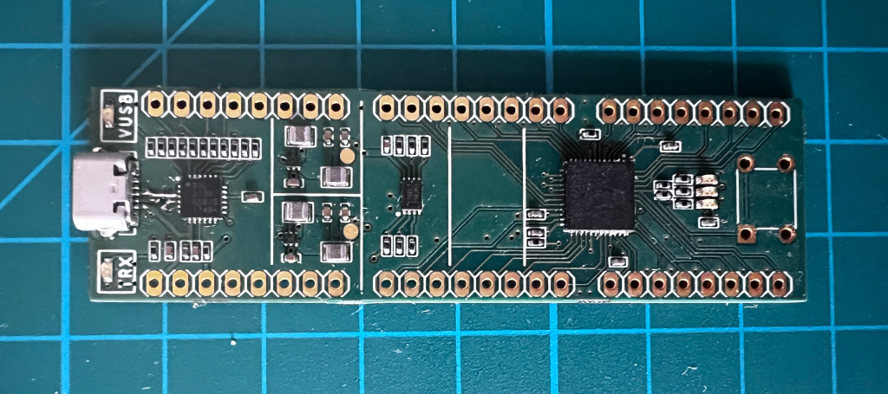
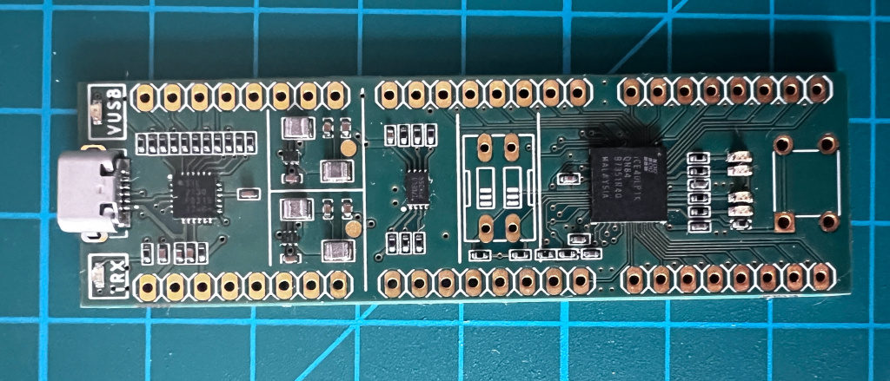

# Synthra Boards

Fully custom-designed FPGA boards by **Adam Łuczak**, created in Eagle PCB.  
Synthra is a modular FPGA board series for learning, prototyping, and embedded development.

---

## Purpose

The goal is to provide compact yet expandable FPGA boards suitable for:

- digital logic and HDL education,
- rapid development and testing,
- small-to-medium scale logic-based systems.

Each board is optimized for modifiability, signal accessibility, and easy hand-soldering.

---

## Available Boards

### Synthra‑E5‑HR

- **FPGA:** Lattice ECP5 (LFE5U‑12 / ‑25 / ‑45 / ‑85)
- **ECP5 features:**
  - Up to 84k LUTs and 3.7 Mb block RAM
  - Multiple PLLs and global clocks
  - Hardware multipliers, DSP support
  - Supported by open-source tools (Yosys, NextPNR)
- **Memory:** Two solder-selectable footprints for HyperRAM or HyperFLASH

- **Peripherals:**
  - 10 user LEDs
  - 2 system state LEDs (power, configuration done)
  - 2 buttons (Reset + User)
  - Bottom-side 6-pin ZIF connector for debug or general-purpose I/O
- **Power & Programming:** USB-C with integrated FTDI/JTAG
- **Form Factor:** Breadboard-compatible 2.54 mm headers

---

### Synthra‑UP‑5K

- **FPGA:** Lattice iCE40 UltraPlus (iCE40UP5K‑SG48)

- **Key features:**
  - 5,280 LUTs, 1 Mb RAM, 8 DSP blocks
  - Integrated LED drivers, SPI/I²C, PWM
  - Ultra-low power and instant-on functionality
  - Internal oscillator
- Compact and ideal for mobile or low-power designs.

---

### Synthra‑IC‑1K

- **FPGA:** Lattice iCE40HX1K (TQFP‑144)

  
- **Key features:**
  - 1,280 LUTs, 64 Kb block RAM
  - High GPIO availability
  - Fully supported by open-source toolchains
- Entry-level board ideal for education and experimentation.

---

## Contact

PCB design files are not public.  
If you're interested in collaboration, board availability, or further technical details, contact:

**adam.luczak@outlook.com**

---

**Synthra – Logic in your hands.**  
Designed and developed by Adam Łuczak.
